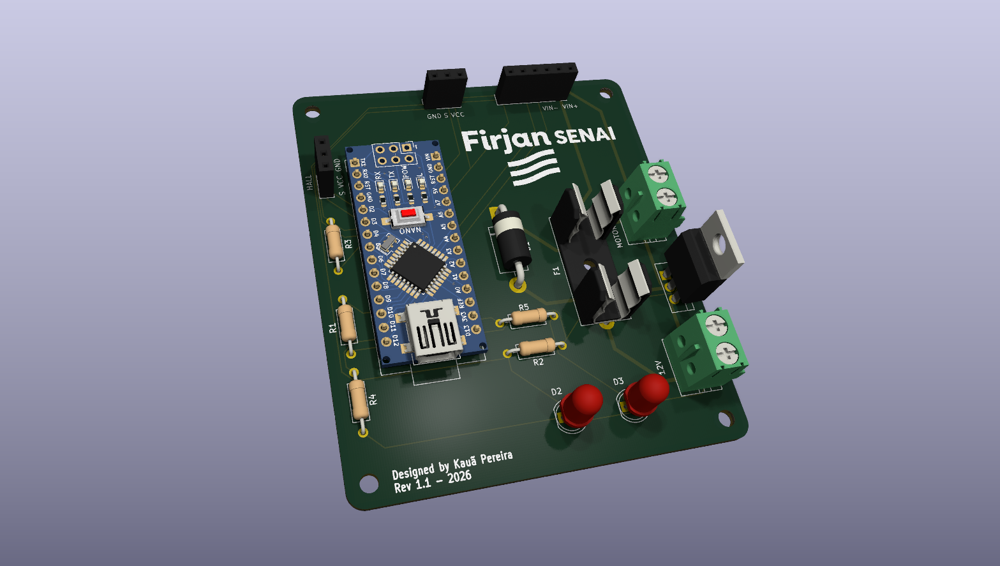
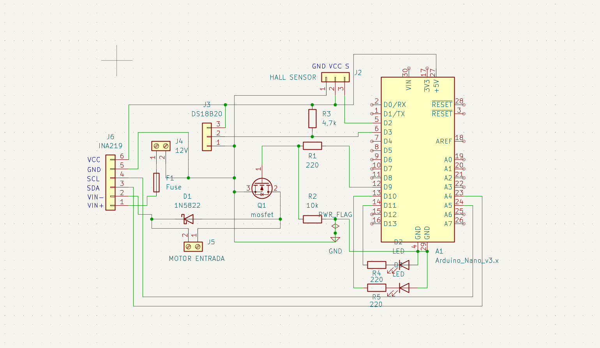

# 🔧 Arduino Nano Motor Controller

> Placa de circuito impresso baseada em Arduino Nano para controle PWM de motores DC, com telemetria de corrente, tensão, temperatura e rotação, e proteção térmica automática.

---

## 📌 Sobre o projeto

A placa controla a velocidade de um motor DC via PWM, monitora suas condições de operação em tempo real (corrente, tensão, temperatura e rotação) e interrompe automaticamente o motor em caso de superaquecimento ou sobrecorrente.

## 🖼️ Visão geral

<p align="center">
  
</p>
<p align="center">
  
</p>

## ⚙️ Funcionalidades

- **Controle de velocidade via PWM**, ajustável remotamente por comando serial
- **Monitoramento de temperatura em tempo real** com sensor DS18B20
- **Telemetria elétrica** via módulo INA219 (corrente, tensão e potência em tempo real por I2C)
- **Medição de RPM** via sensor Hall, usando interrupção externa para não perder pulsos em alta rotação
- **Trava de segurança automática**: desliga o motor em caso de superaquecimento, sobrecorrente, ou falha/desconexão do sensor de temperatura
- **Indicação visual de status** via LEDs (rodando / parado / falha)
- **Log contínuo via Serial** com todos os dados de operação

## 🧰 Especificações e limites da placa

| Especificação | Valor |
|---|---|
| Tensão máxima | 12V DC |
| Corrente máxima do motor | Até 3A em **STALL** (rotor travado) — o motor recomendado para uso contínuo deve consumir **0.5A - 1A** em operação normal, não 3A constantes |
| Fusível recomendado | 5x20mm, **2A**, tipo slow-blow (retardado) |
| Proteções | Soquete para fusível cilíndrico 5x20mm + diodo de proteção 1N5822 |
| Acionamento do motor | MOSFET IRLZ44N |

## 📋 Lista de materiais (BOM)

### Placa principal e circuito

| Qtd | Componente | Descrição |
|---|---|---|
| 1 | Arduino Nano V3 | Microcontrolador principal |
| 1 | MOSFET IRLZ44N | Controle PWM do motor |
| 1 | Diodo 1N5822 | Proteção flyback / roda livre |
| 2 | Borne terminal 5mm (2 pinos) | Entrada de alimentação 12V e saída para o motor |
| 1 | Soquete de fusível | Porta-fusível 5x20mm |
| 2 | LED 5mm | Indicação de status / sinalização |
| 1 | Resistor 4.7kΩ | Pull-up do sensor de temperatura |
| 1 | Resistor 10kΩ | Pull-down do MOSFET |
| 2 | Resistor 220Ω | Limitação de corrente dos LEDs |
| 2 | Header fêmea 1x03 | Sensor Hall e DS18B20 |
| 1 | Header fêmea 1x06 | Conector do módulo INA219 |
| 2 | Header fêmea 1x15 | Soquete para encaixe do Arduino Nano (um de cada lado) |

### Sensores externos suportados

| Sensor | Função | Comunicação |
|---|---|---|
| DS18B20 | Temperatura | 1-Wire
| INA219 | Corrente, tensão e potência | I2C |
| Sensor Hall (3 pinos) | Rotação / RPM | Digital |

## 🔌 Montagem

O Arduino Nano é encaixado diretamente nos headers da própria PCB — não há fiação manual entre o microcontrolador e os componentes da placa, já que o layout do circuito fixa essas conexões fisicamente. Basta encaixar o Nano na posição correta (a serigrafia indica a orientação) e conectar os sensores externos (DS18B20, INA219, sensor Hall) nos headers dedicados.

> 💡 **Sobre a soldagem:** é possível soldar todos os componentes diretamente na placa, incluindo o próprio Arduino Nano direto nos pinos da PCB, sem usar headers. **A recomendação, porém, é usar headers fêmea** (os 1x15 para o Nano e os menores para os sensores). Isso permite remover o Arduino ou os sensores para testes, reprogramação fora da placa, ou substituição em caso de defeito, sem precisar dessoldar nada.

**Mapeamento fixo definido pela placa:**

| Função | Pino do Nano |
|---|---|
| PWM do motor (gate do MOSFET) | D9 |
| DS18B20 (temperatura) | D3 |
| Sensor Hall (RPM) | D2 |
| INA219 (I2C) | A4 (SDA) / A5 (SCL) |
| LED — motor rodando | D11 |
| LED — motor parado / falha | D10 |

## 🖥️ Firmware

O código-fonte está em [`motor_code.ino`](./motor_code.ino).

### Bibliotecas necessárias
Instale pelo Gerenciador de Bibliotecas da Arduino IDE:
- `OneWire`
- `DallasTemperature`
- `Adafruit INA219` (+ `Adafruit BusIO`)

### Comandos via Serial (9600 baud)

| Comando | Ação |
|---|---|
| `Vxxx` | Define a velocidade do motor (0–255). Ex: `V150` |
| `S` | Para o motor |
| `R` | Reseta uma falha de segurança (temperatura, corrente ou sensor desconectado) |

### Lógica de segurança
- Se a temperatura ultrapassar **70°C**, o motor é desligado automaticamente
- Se a corrente ultrapassar **3A**, o motor é desligado automaticamente
- Se o sensor DS18B20 desconectar ou falhar, o motor também é desligado (falha "às cegas" não é permitida)
- Uma vez em falha, o motor **permanece desligado** até o comando `R` ser enviado — evita religamento automático indesejado

### Como gravar
1. Abra `motor_code.ino` na Arduino IDE
2. Selecione a placa **Arduino Nano** e a porta serial correta
3. Instale as bibliotecas listadas acima
4. Grave e abra o Monitor Serial (9600 baud) para acompanhar os dados em tempo real

## 🖥️ Hardware — como fabricar

1. Baixe os arquivos de fabricação em [`Gerbers_Files.zip`](./Gerbers_Files.zip) e mande fabricar a placa (usado PCBWay no projeto original)
2. Solde os componentes conforme a lista de materiais acima
3. Conecte os sensores externos nos headers correspondentes
4. Conecte a alimentação de 12V e o motor DC nos bornes terminais

### Abrindo o projeto no KiCad
```
PCB_Motor.kicad_pro   → projeto principal (abra este primeiro)
PCB_Motor.kicad_sch   → esquemático
PCB_Motor.kicad_pcb   → layout da placa
```

## 📂 Estrutura do repositório

```
├── 3D_View_PCB.png            → render 3D da placa
├── SCH.png                     → imagem do esquemático
├── Gerbers_Files.zip           → arquivos para fabricação
├── PCB_Motor.kicad_pcb         → layout da placa (KiCad)
├── PCB_Motor.kicad_pro         → projeto KiCad
├── PCB_Motor.kicad_sch         → esquemático (KiCad)
├── motor_code.ino              → código-fonte do Arduino
├── LICENSE                     → MIT
└── README.md
```

## 📄 Licença

Este projeto está sob a licença MIT — veja o arquivo [LICENSE](./LICENSE) para mais detalhes.

---

#Engenharia #Eletronica #Hardware #PCBDesign #KiCad #Arduino #FirjanSENAI #SistemasEmbarcados #GitHub #OpenSource #Automação
